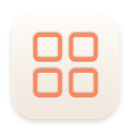
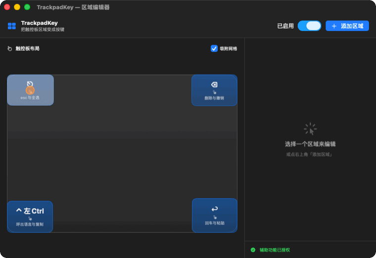

  

<h1 align="center">TrackpadKey</h1>

  <b>把触控板的任意区域，变成你的自定义按键。</b> 
  <b>Turn any spot on your trackpad into a custom key.</b>

  <a href="https://github.com/wongsiufool/trackpadkey/releases/latest/download/TrackpadKey.dmg"><b>⬇️ 下载 Download DMG</b></a>
  &nbsp;·&nbsp; macOS 13+ &nbsp;·&nbsp; Apple Silicon &nbsp;·&nbsp; 妙控板 / 内置触控板

  

轻点区域即触发，键帽实时闪光反馈，手指落点实时预览 · Tap a region to fire — live flash feedback and fingertip preview

---

## 中文

你的触控板每天被手掌划过无数次，却只会移动光标——太浪费了。

**TrackpadKey** 让你在触控板上画出几块小区域，每块绑定一个按键、组合键、甚至一整段文字。轻点一下，就触发——**而区域之外，触控板照常当鼠标用**。把左下角设成"复制"，右下角设成"粘贴"，角落塞一个数字小键盘……你的触控板，你说了算。

### ✨ 功能

- 🎯 **任意区域 → 任意按键**：在可视化编辑器里自由画区域，绑定任意键。比固定角落灵活得多。
- 🖐️ **区域内照样滑动光标**：只"吞掉"轻点产生的那次点击，移动光标完全不受影响——一块区域，既能滑又能按。
- ⌨️ **实时按键录制**：点一下，按下你想要的键即可绑定——单键、组合键（⌘⇧⌥⌃）、连单独的 Ctrl 这种修饰键都能录。
- 🔡 **文本 / 宏输出**：让一个区域输出一整段文字（自动经剪贴板粘贴并还原），常用语、签名、代码片段一点即出。
- ⏱️ **长按不同动作**：同一区域，轻点和长按触发不同动作；长按生效时屏幕弹出 HUD 提示，"感到"它触发了再松手。
- 🎨 **精致可视化编辑器**：拖动移动、四角缩放、网格吸附、对齐参考线、**实时手指落点预览**、触发时键帽闪光。
- 🧭 **全局生效**：在任何 App 里都能用，后台菜单栏常驻。
- 🚀 **开机自启**：登录后自动待命，装好就忘了它的存在。
- 🔏 **已签名 + 公证**：Developer ID 签名并通过 Apple 公证，下载即用、不被 Gatekeeper 拦。
- 🔒 **纯本地 · 不联网 · 不收集任何数据**。

### 📦 安装

1. [下载 `TrackpadKey.dmg`](https://github.com/wongsiufool/trackpadkey/releases/latest/download/TrackpadKey.dmg)。
2. 打开 DMG，把 **TrackpadKey** 拖进「应用程序」。
3. 启动后，菜单栏右上会出现 ▦ 图标。首次会请求**辅助功能**权限：
   系统设置 → 隐私与安全性 → 辅助功能 → 勾选 **TrackpadKey**。
   （若触摸读取无效，到「输入监控」里也勾上。）
4. 菜单栏 ▦ → **打开区域编辑器** → 添加区域、绑定按键，开始用。

### 🕹️ 用法速览

- 画布上**拖动**移动区域、拖**四角**缩放；右侧给区域选「按键」或「文本」。
- 想绑组合键？点录制框，直接按下 `⌘C` 之类即可。
- 想要长按另一个动作？打开「启用长按」，再设一个动作。
- 手指放上触控板，画布会实时显示落点，方便对齐。

### ⚙️ 系统要求

- macOS 13 或更新（在 macOS 26 / Apple Silicon 上开发与测试）。
- 外接**妙控板**或笔记本**内置触控板**（Force Touch / 多点触控）。
- 需要「辅助功能」权限（用于发送按键）。

### ❓ 常见问题

- **会上传我的数据吗？** 不会。完全本地运行，不联网、不收集任何信息。
- **密码框里没反应？** macOS 的安全输入（Secure Input）会屏蔽所有程序合成的按键，这是系统设计，无法绕过。
- **更新后要重新授权吗？** 正常不需要（用稳定签名身份）。

---

## English

Your trackpad gets swiped a thousand times a day — and all it does is move the cursor. What a waste.

**TrackpadKey** lets you draw small regions on your trackpad and bind each one to a key, a shortcut, or even a whole snippet of text. Tap to fire — **while the rest of the trackpad keeps working as a normal cursor.** Make the bottom-left "Copy", the bottom-right "Paste", tuck a number pad into a corner… your trackpad, your rules.

### ✨ Features

- 🎯 **Any region → any key.** Draw regions freely in a visual editor and bind them to any key. Far more flexible than fixed corners.
- 🖐️ **Cursor still moves inside regions.** Only the *tap's click* is swallowed; pointer movement is untouched — one region both swipes and types.
- ⌨️ **Live key recording.** Click, then press the key you want — single keys, combos (⌘⇧⌥⌃), even a lone modifier like Ctrl.
- 🔡 **Text / macro output.** Make a region paste a whole string (via clipboard, then restored). Canned replies, signatures, snippets — one tap.
- ⏱️ **Long-press for a second action.** Tap and long-press do different things; an on-screen HUD confirms the long-press fired so you know when to release.
- 🎨 **Polished visual editor.** Drag, resize from any corner, snap to grid, alignment guides, **live fingertip preview**, and a flash when a region fires.
- 🧭 **Works everywhere.** System-wide, in any app, from the menu bar.
- 🚀 **Launch at login.** Set it up once and forget it's there.
- 🔏 **Signed & notarized.** Developer ID signed and Apple-notarized — download and run, no Gatekeeper hassle.
- 🔒 **100% local. No network. No data collected.**

### 📦 Install

1. [Download `TrackpadKey.dmg`](https://github.com/wongsiufool/trackpadkey/releases/latest/download/TrackpadKey.dmg).
2. Open the DMG and drag **TrackpadKey** into Applications.
3. Launch it — a ▦ icon appears in the menu bar. Grant **Accessibility** when prompted:
   System Settings → Privacy & Security → Accessibility → enable **TrackpadKey**.
   (If touch reading doesn't work, also enable it under Input Monitoring.)
4. Menu bar ▦ → **Open Region Editor** → add regions and bind keys.

### ⚙️ Requirements

- macOS 13+ (developed & tested on macOS 26, Apple Silicon).
- An external **Magic Trackpad** or a built-in trackpad (Force Touch / multi-touch).
- Accessibility permission (to synthesize key presses).

### ❓ FAQ

- **Does it phone home?** No. Fully local, no network, no data collection.
- **Nothing happens in password fields?** macOS Secure Input blocks all synthetic keystrokes there by design — it can't be bypassed.
- **Re-authorize after updates?** Normally no (stable signing identity).

---

Made for people who think a trackpad should do more.

